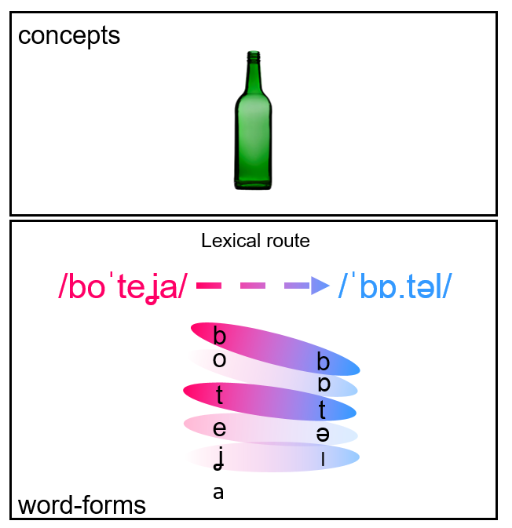
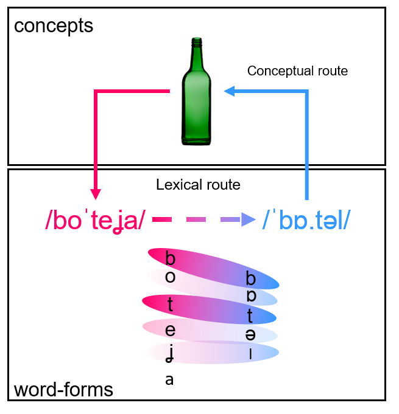
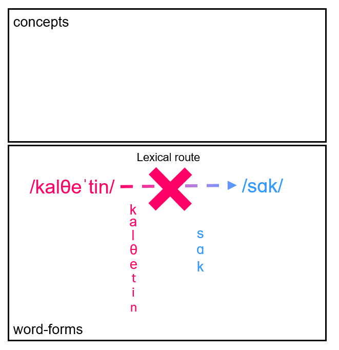

class:

```{r setup, echo=FALSE, message=FALSE, warning=FALSE}
knitr::opts_chunk$set(
	message = FALSE,
	warning = FALSE,
	include = TRUE,
	dpi = 1000
)

library(knitr)
library(dplyr)
library(tidyr)
library(ggplot2)
library(patchwork)
library(tibble)
library(scales)
library(gt)
library(tidybayes)
library(purrr)
library(brms)
library(janitor)
library(papaja)
library(data.table)
library(stringr)
library(forcats)
library(here)


options(
	knitr.kable.NA = '-',
	htmltools.preserve.raw = FALSE,
	knitr.duplicate.label = "allow",
	ggplot2.discrete.fill = c("#1A85FF", "#ff2976", "#FFC20A"),
	ggplot2.discrete.colour = c("#1A85FF", "#ff2976", "#FFC20A"),
	ggplot2.continuous.fill = scale_fill_gradient2(
		low = "#04bf78", mid = "white", high = "#FFC20A", 
		na.value = "white", limits = c(-0.4, 0.4)
	),
	ggplot2.continuous.colour = scale_fill_gradient2(
		low = "#04bf78", mid = "white", high = "#FFC20A", 
		na.value = "white", limits = c(-0.4, 0.4)
	)
)

theme_set(theme_ggdist())

# import data
participants <- readRDS(here("data", "participants.rds")) %>% 
	mutate(
		valid_participant_label = ifelse(valid_participant, "Valid", "Not valid"),
		group = case_when(
			group=="ENG-CAT" ~ "cat-ENG",
			group=="ENG-SPA" ~ "spa-ENG",
			group=="SPA-CAT" ~ "cat-SPA"
		)
	) 

stimuli <- readRDS(here("data", "stimuli.rds")) %>% 
	mutate(test_language = ifelse(group=="ENG-SPA", "Spanish", "Catalan"))

fit_6 <- readRDS(here("data", "fit_6.rds"))

responses <- readRDS(here("data", "responses.rds"))


clearpond <- fread(here("data", "englishCPdatabase2.txt")) %>% 
	as_tibble() %>% 
	set_names(readLines(here("data", "clearpondHeaders_EN.txt"), warn = FALSE)) %>% 
	clean_names()
```

# Non-native speech-comprehension

Even for proficient bilinguals, non-native **speech comprehension is costly**<sup>1,2</sup>

<br>

.footnote[
[1] Lecumberri et al. (2010), [2] Takata and Nábělek (1990), [3] Cutler et al. (2004), [4] Christoffels et al. (2006)
]

--

**Phonological mismatches** partly explain why:

> English /ˈpeɪpɚ/ to Spanish /pa'pel/ (/ɪ/ and /ɚ/ do not exist in Spanish)

--


**Lexical processing** mechanisms are engaged despite these mismatches<sup>3</sup>, provided some acoustic similarity between the input and the native word-form


---
class:

# Non-native word recognition

Even in **total absence of familiarity** with the language, some sound sequences can trigger **word recognition**:

> **Cognates** (form-similar translations)<sup>4</sup>:

> Hearing/reading *botella* in Spanish can elicit *bottle* in the English listener 

<br>

--

In absence of conceptual knowledge, **phonological similarity** is the only source of information

> To what extent is **cross-language phonological similarity** sufficient for word recognition?

> Previous literature relies on **bilingual samples** (who can exploit both conceptual and lexical information)


---
class:

# The present study

We asked adults to **translate words from an unfamiliar language** to their native language:

> If the lexical route is sufficient for translation, listeners should benefit from **phonological overlap**

**Translation elicitation** task:

.center[

]


---
class:

<br>

.center[

]

---
class:

<br>

.center[

]

---
class:

<br>

.center[

]

---
class:

<br>

.center[

]

---
class:

<br>

.center[

]

---
class:

<br>

.center[

]

---
class:

<br>

.center[

]

---
class:

# Methods

## Participants

**Online** recruitment and data collection (PsychoPy/Pavlovia)

<br>

* 34 **English natives** translating **Spanish words** (spa &rarr; ENG)
* 29 **English natives** translating **Catalan words** (spa &rarr; ENG)
* 28 **Spanish natives** translating **Catalan words** (cat &rarr; SPA)

<br>

Self-reported proficiency in language of test < 2 in a 1-5 scale

Proficiency in any other Romance language (e.g., Italian, Portuguese) < 3


---

# Stimuli 

High-frequency words uttered in child-directed speech

Recorded by a Catalan-Spanish proficient bilingual

**Catalan list**: `r stimuli %>% count(group) %>% pull(n) %>% .[1]` words
**Spanish list**: `r stimuli %>% count(group) %>% pull(n) %>% .[2]` words

<br>

---
class:

# Predictors

## Phonological similarity (Lenveshtein similarity)

> Phonological similarity between presented and target words<sup>1, 2</sup>

**Levenshtein distance**: number of editions separating two character strings

<br>

$$
\begin{align}
1 - \frac{\text{Levenshtein distance}}{Max(\text{Stimulus length}, \text{Translation length})}
\end{align}
$$

<br>

```{r echo=TRUE, message=FALSE, warning=FALSE, paged.print=FALSE}
stringdist::stringdist("teɪbəl", "mesa")
stringdist::stringsim("teɪbəl", "mesa")
```


<br>

```{r echo=TRUE, message=FALSE, warning=FALSE, paged.print=FALSE}
stringdist::stringdist("trEIn", "tɾEn")
stringdist::stringsim("trEIn", "tɾEn")
```


<br>

.footnote[
[1] Floccia, C., et al. (2018), [2] Levenshtein (1966)
]


class:

# Predictors

## Higher-frequency phonological neighbourhood density (*PTHN*)

> Number of phonological neighbours with higher frequency (from CLEARPOND <sup>1,2</sup>)

*calcetín*-*sock*: `r clearpond %>% filter(word %in% "sock") %>% pull(e_pthw) %>% strsplit(split = ";") %>% length()`

`r clearpond %>% filter(word %in% "sock") %>% pull(e_pthw) %>% strsplit(split = ";") %>% unlist() %>% paste0(collapse = ", ")`

*mesa*-*table*: `r clearpond %>% filter(word %in% "sock") %>% pull(e_pthw) %>% strsplit(split = ";") %>% length()`

`r clearpond %>% filter(word %in% "bird") %>% pull(e_pthw) %>% strsplit(split = ";") %>% unlist() %>% paste0(collapse = ", ")`


.footnote[
[1] Marian et al. (2012), [2] Van Heuven et al. (1998)
]


---
class:

# Predictors

```{r stimuli-plot, echo=FALSE, message=FALSE, warning=FALSE, paged.print=FALSE, include=TRUE, out.width="100%", fig.height=5, dpi=1200}

medians <- stimuli %>% 
	group_by(group) %>% 
	summarise(
		pthn_median = median(pthn),
		pthn_sd = sd(pthn),
		frequency_zipf_median = median(frequency_zipf),
		frequency_zipf_sd = sd(frequency_zipf),
		lv_median = median(lv),
		lv_sd = sd(lv)
	) %>% 
	mutate(group = case_when(
		group=="ENG-CAT" ~ "cat-ENG",
		group=="ENG-SPA" ~ "spa-ENG",
		group=="SPA-CAT" ~ "cat-SPA",
	))

# frequency
stimuli %>% 
	mutate(group = case_when(
		group=="ENG-CAT" ~ "cat-ENG",
		group=="ENG-SPA" ~ "spa-ENG",
		group=="SPA-CAT" ~ "cat-SPA",
	)) %>% 
	ggplot() + 
	aes(frequency_zipf, fill = group) +
	facet_wrap(~group, ncol = 1) + 
	geom_rect(
		data = medians, 
		aes(
			xmin = frequency_zipf_median-frequency_zipf_sd,
			xmax = frequency_zipf_median+frequency_zipf_sd, 
			ymin = -Inf, 
			ymax = Inf,
			fill = group
		),
		inherit.aes = FALSE,
		alpha = 0.15
	) +   
	geom_histogram(bins = 20, colour = "white") +
	geom_vline(
		data = medians, 
		aes(
			xintercept = frequency_zipf_median, 
			group = group
		), 
		colour = "black",
		size = 0.5,
		linetype = "dashed"
	) + 
	geom_text(
		data = medians, 
		aes(
			label = "Median ± SD", 
			x = frequency_zipf_median+1.25,
			y = 13
		), 
		size = 3
	) +
	geom_curve(
		data = medians, 
		aes(
			x = frequency_zipf_median+0.85, 
			xend = frequency_zipf_median+0.1,
			y = 12, 
			yend = 11
		),
		arrow = arrow(length = unit(0.2, "cm")),
		curvature = -0.25,
		colour = "grey30"
	) +
	labs(
		x = "Lexical frequency (Zipf)", 
		y = "Number of trials", 
		title = "Frequency\n(stimuli translations)\n"
	) +
	
	# PTHN
	stimuli %>% 
	count(group, pthn) %>% 
	mutate(group = case_when(
		group=="ENG-CAT" ~ "cat-ENG",
		group=="ENG-SPA" ~ "spa-ENG",
		group=="SPA-CAT" ~ "cat-SPA",
	)) %>% 
	ggplot() + 
	aes(pthn, n, fill = group) +
	facet_wrap(~group, ncol = 1) + 
	geom_rect(
		data = medians, 
		aes(
			xmin = 0, 
			xmax = pthn_median+pthn_sd, 
			ymin = -Inf, 
			ymax = Inf,
			fill = group
		), inherit.aes = FALSE, 
		alpha = 0.15
	) +   
	geom_col(colour = "white") + 
	geom_vline(
		data = medians,
		aes(
			xintercept = pthn_median, 
			group = group
		), 
		colour = "black", 
		size = 0.5, 
		linetype = "dashed"
	) + 
	labs(
		x = "PTHN", 
		y = "Number of trials", 
		title = "Higher-frequency neighbours\n(stimuli translations)\n"
	) +
	theme(
		axis.title.y = element_blank()
	) +
	
	
	# Levenshtein
	stimuli %>% 
	mutate(group = case_when(
		group=="ENG-CAT" ~ "cat-ENG",
		group=="ENG-SPA" ~ "spa-ENG",
		group=="SPA-CAT" ~ "cat-SPA",
	)) %>% 
	ggplot() +
	aes(lv, fill = group) +
	facet_wrap(~group, ncol = 1) + 
	geom_rect(
		data = medians, 
		aes(
			xmin = 0,
			xmax = lv_median+lv_sd, 
			ymin = -Inf,
			ymax = Inf,
			fill = group
		), 
		inherit.aes = FALSE,
		alpha = 0.15
	) +   
	geom_histogram(
		bins = 20, 
		colour = "white"
	) +
	geom_vline(
		data = medians, 
		aes(
			xintercept = lv_median, 
			group = group
		), 
		colour = "black",
		size = 0.5, 
		linetype = "dashed"
	) + 
	scale_x_continuous(labels = percent) +
	labs(
		x = "Levenshtein",
		y = "Number of trials", 
		title = "Phonological similarity\n(stimuli and stimuli translations)\n"
	) +
	theme(
		axis.title.y = element_blank()
	) +
	
	plot_layout(guides = "collect") &
	plot_annotation(tag_levels = "A") &
	scale_fill_manual(
		values = c("#1A85FF", "#ff2976", "#FFC20A"), 
		na.translate = FALSE
	) &
	theme(
		legend.position = "none",
		text = element_text(size = 10),
		strip.text = element_text(size = 10),
		title = element_text(size = 8.5),
		axis.title.x = element_blank()
	)

```

---
class: 

# Predictors

## Lexical frequency (Zipf score)

> Lexical frequency of target word (from SUBTLEX-ENG<sup>1</sup> and SUBTLEX-SPA<sup>2</sup>) in Zipf scores

<br>

$$
\begin{align}
Frequency = log_{10}(fpmw+3) \\ \text{fpmw: frequency per million words}
\end{align}
$$


.footnote[
[1] Cuetos et al. (2012), [2] Boada et al. (2020), [3] Marian et al. (2012)
]

---
class:

# Predictors

## Group (*a priori* contrasts)

Do Spanish listeners perform better than English listeners after accounting for phonological similarity?

> eng-CAT & eng-SPA vs. spa-CAT

Do English listeners perform better translating Spanish words than Catalan words?

* eng-CAT vs. eng-SPA


---
class: 

# Data analysis

* Responses manually coded as **correct/incorrect** (typos allowed)

--

* **Logistic regression**

- Response variable: probability of **correct translation**
- Predictors: **Levenshtein**, ***PTHN***, **Group** (3-way interaction), and **Frequency** (nuance predictor)

--

* **Multilevel Bayesian model** (`brms`/Stan): *participants* and *items* as grouping variables

--

* We incrementally added predictors and selected model with **best predictive accuracy**

> Leave-one-one cross-validation (*LOO*)

---
class:

# Results

```{r posterior-fixed, echo=FALSE, message=FALSE, warning=FALSE, paged.print=FALSE, out.width="100%", fig.height=4, fig.width=6.5, dpi=900}

posterior_draws_fixed <- gather_draws(fit_6, `b_.*`, `sd_.*`, regex = TRUE)

coefs <- fixef(fit_6) %>% 
	as.data.frame() %>% 
	rownames_to_column("variable") %>% 
	clean_names() %>% 
	mutate_at(
		vars(estimate:q97_5),
		~ifelse(
			variable=="Intercept",
			inv_logit_scaled(.), 
			./4
		)
	) %>% 
	group_split(variable) %>% 
	set_names(make_clean_names(map(., "variable"))) %>% 
	map(select, -variable) %>% 
	map(unlist)

str_repl <- c(
	"Intercept" = "Intercept",
	"frequency_zipf_std" = "Frequency\n[+1 SD]",
	"pthn_std:lv_std" = "PTHN \u00d7 Levenshtein", 
	"lv_std:groupENGvs.SPA" = "Levenshtein \u00d7 Group 1",
	"lv_std:groupENGMCATvs.ENGMSPA" = "Levenshtein \u00d7 Group 2",
	"lv_std" = "Levenshtein\n[+1 SD]",
	"pthn_std" = "PTHN\n[+1 SD]",
	"groupENGvs.SPA" =  "Group 1\n[ENG-* vs. SPA-CAT]",
	"groupENGMCATvs.ENGMSPA" = "Group 2\n[ENG-CAT vs. ENG-SPA]"
)


# fixed effects
posterior_draws_fixed %>% 
	filter(str_detect(.variable, "b_")) %>% 
	mutate(
		.variable_name = str_remove(.variable, "b_") %>% 
			str_replace_all(str_repl) %>%  
			factor(
				levels = c(
					"Intercept", "Frequency\n[+1 SD]", "PTHN\n[+1 SD]", 
					"Levenshtein\n[+1 SD]", "PTHN \u00d7 Levenshtein",
					"Group 1\n[ENG-* vs. SPA-CAT]",
					"Group 2\n[ENG-CAT vs. ENG-SPA]",
					"Levenshtein \u00d7 Group 1", "Levenshtein \u00d7 Group 2"
				)
			),
		.value = ifelse(
			str_detect(.variable, "Intercept"), 
			inv_logit_scaled(.value), 
			.value/4
		)
	) %>% 
	arrange(.variable) %>% 
	ggplot() +
	aes(.value, fct_rev(.variable_name)) +
	geom_vline(xintercept = 0) +
	stat_slab(
		aes(fill = stat(cut_cdf_qi(cdf, .width = c(.5, .8, .95), labels = percent_format())))
	) +
	stat_pointinterval(
		.width = 0, 
		point_size = 1
	) +
	scale_fill_manual(
		values = c("#1A85FF", "#9ccaff", "#d2e5fc"), 
		na.translate = FALSE
	) +
	scale_x_continuous(
		labels = function(x) percent(round(x, 1))
	) +
	labs(
		x = "P(Correct)",
		y = "Posterior probability density",
		fill = "CrI"
	) +
	theme(
		legend.position = c(1, 0.25),
		legend.justification = "right",
		legend.direction = "vertical",
		legend.background = element_rect(fill = "grey95"),
		legend.key = element_rect(fill = "grey95", colour = "grey95"), 
		legend.key.height = unit(0.1, "cm"),
		axis.title.y = element_blank(),
		legend.text = element_text(size = 7),
		axis.text.x = element_text(colour = "black"),
		axis.text.y = element_text(colour = "black", hjust = 1),
		axis.ticks.y = element_blank(),
		panel.grid.major.y = element_line(colour = "grey", size = 0.5)
	) 
```


---
class:

```{r predictions, echo=FALSE, message=FALSE, warning=FALSE, paged.print=FALSE, out.width="100%", fig.height=4, fig.width=7, dpi=900, fig.align='center'}

nd <- expand.grid(
	lv_std = c(
		min(fit_6$data$lv_std),
		0,
		max(fit_6$data$lv_std)
	),
	frequency_zipf_std = 0,
	pthn_std = seq(
		min(fit_6$data$pthn_std, na.rm = TRUE),
		max(fit_6$data$pthn_std, na.rm = TRUE),
		by = 0.1
	),
	group = unique(fit_6$data$group)
)

m <- add_epred_draws(
	nd, 
	fit_6, 
	ndraws = 100, 
	re_formula = NA
) %>% 
	mutate(
		lv_std = factor(
			lv_std,
			levels = c(
				min(fit_6$data$lv_std),
				0,
				max(fit_6$data$lv_std)
			),
			labels = c(
				paste0("-1 SD (", percent(min(responses$lv, na.rm = TRUE)), ")"),
				paste0("Mean (", percent(mean(responses$lv, na.rm = TRUE)), ")"),
				paste0("+1 SD (", percent(max(responses$lv, na.rm = TRUE)), ")")
			)
		) 
	)


ggplot(m) +
	aes(
		pthn_std, 
		.epred,
		colour = lv_std,
		fill = lv_std
	) +
	facet_wrap(~group) +
	geom_hline(
		yintercept = 0.5, 
		colour = "grey"
	) +
	geom_line(
		aes(group = interaction(lv_std, .draw)), 
		size = 0.65,
		alpha = 0.5,
		show.legend = TRUE
	) +
	stat_summary(
		aes(linetype = lv_std), 
		fun = mean, 
		geom = "line",
		colour = "black", 
		size = 0.75,
		show.legend = TRUE
	) +
	annotate(
		"segment", 
		x = -0.5, 
		xend = -0.9, 
		y = 0.85, 
		yend = 0.85, 
		arrow = arrow(length = unit(0.1, "cm")), 
		size = .5
	) +
	annotate(
		"segment", 
		x = 2.25, 
		xend = 2.65, 
		y = 0.85, 
		yend = 0.85, 
		arrow = arrow(length = unit(0.1, "cm")),
		size = .5
	) +
	annotate(
		"text", 
		x = -0.5, 
		y = 0.95, 
		size = 2.75,
		label = "Less similar"
	) +
	annotate(
		"text", 
		x = 2.15, 
		y = 0.95, 
		size = 2.75,
		label = "More similar"
	) +
	labs(
		x = paste0("PTHN (+1 SD, ", round(sd(responses$pthn), 1), " higher-frequency neighbours)"),
		y = "P(Correct)", 
		colour = "Levenshtein similarity",
		fill = "Levenshtein similarity",
		linetype = "Levenshtein similarity",
		title = "Population-level posterior predictions"
	) +
	scale_y_continuous(
		labels = function(x) percent(round(x, 2)),
		limits = c(0, 1),
		breaks = seq(0, 1, 0.1)
	) +
	theme(
		legend.position = "top",
		plot.title = element_blank()
	)

```


---
class:

# Discussion

Overall, participants were ~45% accurate

--

Participants benefited from phonological overlap (*Levenshtein*: +15% accuracy)

--

No evidence of competition for selection in the target language (no effect of *PTHN*)

--

Speakers of a similar language (cat-SPA):

> Were **more accurate**, even controlling for phonological overlap

> **Benefited more** from phonological overlap

--

**The lexical route is very informative for translation, even without conceptual knowledge**


---
class: inverse, center, middle


# References

Lecumberri, M. L. G., Cooke, M., & Cutler, A. (2010). Non-native speech perception in adverse conditions: A review. Speech communication, 52(11-12), 864-886.

Takata, Y., & Nábělek, A. K. (1990). English consonant recognition in noise and in reverberation by Japanese and American listeners. The Journal of the Acoustical Society of America, 88(2), 663-666.

Cutler, A., Weber, A., Smits, R., & Cooper, N. (2004). Patterns of English phoneme confusions by native and non-native listeners. The Journal of the Acoustical Society of America, 116(6), 3668-3678.

Christoffels, I. K., De Groot, A. M., & Kroll, J. F. (2006). Memory and language skills in simultaneous interpreters: The role of expertise and language proficiency. Journal of Memory and Language, 54(3), 324-345.

Floccia, C., Sambrook, T. D., Delle Luche, C., Kwok, R., Goslin, J., White, L., ... & Patricia, J. (2018). Vocabulary of 2-year-olds learning English and an additional language: norms and effects of linguistic distance. Monographs of the Society for Research in Child Development, 83(1), 7-108.

Levenshtein, V. I. (1966, February). Binary codes capable of correcting deletions, insertions, and reversals. In Soviet physics doklady (Vol. 10, No. 8, pp. 707-710).

Marian, V., Bartolotti, J., Chabal, S., & Shook, A. (2012). CLEARPOND: Cross-linguistic easy-access resource for phonological and orthographic neighborhood densities.

Van Heuven, W. J., Dijkstra, T., & Grainger, J. (1998). Orthographic neighborhood effects in bilingual word recognition. Journal of memory and language, 39(3), 458-483.

Cuetos, F., Glez-Nosti, M., Barbón, A., & Brysbaert, M. (2012). SUBTLEX-ESP: Spanish word frequencies based on film subtitles. Psicológica, 33(2), 133-143.

# Appendix

---
class:

```{r posterior-sds, echo=FALSE, message=FALSE, warning=FALSE, paged.print=FALSE, out.width="100%", fig.height=4, fig.width=6.5, dpi=900}

# SD of random effects
post_sd_data <- posterior_draws_fixed %>% 
	filter(str_detect(.variable, "sd_")) %>% 
	mutate(
		.variable_name = str_remove(.variable, "sd_participant__|sd_word__") %>% 
			str_replace_all(str_repl) %>% 
			factor(
				levels = c(
					"Intercept", "Frequency\n[+1 SD]", "PTHN\n[+1 SD]", 
					"Levenshtein\n[+1 SD]", "PTHN \u00d7 Levenshtein",
					"Group 1\n[ENG-* vs. SPA-CAT]",
					"Group 2\n[ENG-CAT vs. ENG-SPA]",
					"Levenshtein \u00d7 Group 1", "Levenshtein \u00d7 Group 2"
				)
			),
		group = case_when(
			str_detect(.variable, "participant") ~ "Participants",
			str_detect(.variable, "word") ~ "Words"
		),
		.value = ifelse(str_detect(.variable, "Intercept"), inv_logit_scaled(.value), .value/4)
	) 

ggplot(filter(post_sd_data, group=="Participants"), aes(.value, fct_rev(.variable_name))) +
	stat_slab(
		aes(fill = stat(cut_cdf_qi(cdf, .width = c(.5, .8, .95), labels = percent_format())))
	) +
	stat_pointinterval(.width = 0, point_size = 1) +
	scale_fill_manual(
		values = c("#ff2976", "#f2a7c2", "#fcd9e6"), 
		na.translate = FALSE
	) +
	scale_x_continuous(
		labels = percent,
		limits = c(0, 1)
	) +
	labs(
		x = "SDs in P(Correct)",
		title = "By participant", 
		fill = "CrI"
	) +
	theme(axis.text.x = element_blank()) +
	
	ggplot(
		filter(post_sd_data, group=="Words")
	) +
	aes(.value, fct_rev(.variable_name)) +
	stat_slab(aes(fill = stat(cut_cdf_qi(cdf, .width = c(.5, .8, .95), labels = percent_format())))) +
	stat_pointinterval(
		.width = 0, 
		point_size = 1
	) +
	scale_x_continuous(
		labels = percent, 
		limits = c(0, 1)
	) +
	scale_fill_manual(
		values = c("#ff2976", "#f2a7c2", "#fcd9e6"), 
		na.translate = FALSE
	) +
	labs(
		x = "SDs in P(Correct)",
		title = "By item",
		fill = "CrI"
	) +
	
	plot_layout(ncol = 1, heights = c(0.85, 0.15), guides = "collect") &
	theme(
		legend.position = "none",
		legend.justification = "right",
		axis.text.y = element_text(hjust = 1),
		axis.title.x = element_blank(),
		legend.direction = "vertical",
		axis.title.y = element_blank(),
		legend.background = element_rect(fill = "grey95"),
		legend.key.height = unit(0.1, "cm"),
		legend.key = element_rect(fill = "grey95", colour = "grey95"),
		legend.text = element_text(size = 7),
		axis.ticks.y = element_blank(),
		panel.grid.major.y = element_line(colour = "grey", size = 0.5)
	) 
```


---

class: center, middle

```{r participants-l2, echo=FALSE, message=FALSE, warning=FALSE, paged.print=FALSE, out.width="100%"}
counts <- participants %>% 
	filter(valid_participant) %>% 
	mutate(
		l2 = case_when(
			l2=="Alemã\u0081n" ~ "German",
			l2=="Francã\u2030s" ~ "French",
			l2=="Cuã\u0081l" ~ "Missing",
			TRUE ~ l2
		),
		l2 = ifelse(l2=="Missing", "Other", l2)
	) %>% 
	count(group, name = "n_total")

participants %>% 
	filter(valid_participant) %>% 
	mutate(
		l2 = case_when(
			l2=="Alemã\u0081n" ~ "German",
			l2=="Francã\u2030s" ~ "French",
			l2=="Cuã\u0081l" ~ "Missing",
			TRUE ~ l2
		),
		l2 = ifelse(l2=="Missing", "Other", l2)
	) %>% 
	count(group, l2) %>% 
	
	left_join(counts) %>% 
	mutate(group = paste0(group,  "\n(N = ", n_total, ")")) %>% 
	arrange(group, desc(n)) %>% 
	select(group, l2, n) %>% 
	pivot_wider(names_from = group, values_from = n) %>% 
	gt() %>% 
	fmt_missing(everything(), rows = everything(), missing_text = "-") %>% 
	cols_label(
		l2 = "L2"
	)
```

---
class:

```{r post-re-word, echo=FALSE, fig.height=9, fig.width=7, message=FALSE, warning=FALSE, paged.print=FALSE}
fixed_intercept <- fixef(fit_6)[1,c(1, 3, 4)] %>% 
	inv_logit_scaled()

post_re <- gather_draws(fit_6, r_word[word, .param]) %>% 
	ungroup() %>% 
	arrange(word, .param) %>% 
	mutate(
		.param_name = str_replace_all(.param, str_repl) %>%  
			factor(
				levels = c(
					"Intercept", "Frequency\n[+1 SD]", "PTHN\n[+1 SD]", 
					"Levenshtein\n[+1 SD]", "PTHN \u00d7 Levenshtein",
					"Group 1\n[ENG-* vs. SPA-CAT]",
					"Group 2\n[ENG-CAT vs. ENG-SPA]",
					"Levenshtein \u00d7 Group 1", "Levenshtein \u00d7 Group 2"
				)
			),
		.value = inv_logit_scaled(.value)
	)

ggplot(post_re, aes(.value, reorder(as.factor(word), .value))) +
	geom_vline(xintercept = fixed_intercept[1], colour = "grey", size = 1) +
	
	stat_interval(
		size = 1.5,
		.width = c(0.5, 0.67, 0.95)
	) +
	annotate(
		geom = "text",
		x = 0.7,
		y = 100,
		size = 3,
		hjust = 0.5,
		label = "Item accuracy \n(95%, 67%, and 50% CrI \nof item-level intercepts)"
	) +
	annotate(
		geom = "rect",
		alpha = 0.15,
		xmin = fixed_intercept[2],
		xmax = fixed_intercept[3],
		ymin = -Inf,
		ymax = Inf
	) +
	annotate(
		x = 0.7,
		xend = 0.6,
		y = 108,
		yend = 130,
		geom = "curve",
		curvature = 0.25,
		arrow = arrow(length = unit(0.2, "cm"))
	) +
	annotate(
		geom = "text",
		x = 0.8,
		y = 10,
		size = 3,
		hjust = 0.5,
		label = "Global posterior accuracy\n(Mean ± 95% CrI of the \npopulation-level intercept)"
	) +
	annotate(
		x = 0.7,
		xend = fixed_intercept[1]+0.05,
		y = 17,
		yend = 30,
		geom = "curve",
		curvature = 0.2,
		arrow = arrow(length = unit(0.2, "cm"))
	) +
	labs(
		x = "Posterior probability of correct response",
		y = "Item",
		colour = "Credible Interval (CrI)"
	) +
	scale_color_manual(
		values = c("#d2e5fc", "#9ccaff", "#1A85FF"),
		na.translate = FALSE, 
		labels = paste0(c(95, 67, 50), "%")
	) +
	scale_x_continuous(
		limits = c(0, 1), 
		labels = percent
	) +
	theme(
		legend.position = c(0.1, 0.9),
		legend.direction = "vertical",
		legend.justification = "left",
		legend.key = element_rect(fill = NA, colour = NA),
		panel.grid.major.x = element_line(colour = "grey", linetype = "dotted"),
		axis.text.x = element_text(size = 7),
		axis.text.y = element_blank(),
		axis.ticks = element_blank(),
		axis.title = element_text(size = 10),
		plot.caption.position = "plot",
		plot.caption = element_text(size = 9, hjust = 0, face = "plain", margin = margin(t = unit(3, "cm")))
	)

```

---
class:

```{r posterior-correlations, echo=FALSE, message=FALSE, warning=FALSE, paged.print=FALSE, out.width="100%", fig.height=6, dpi=900}
# Pearson correlations between random effects
corr_mat <- VarCorr(fit_6, summary = TRUE)$participant$cor 
corr_names <- rownames(VarCorr(fit_6, summary = TRUE)$participant$cor)

corr_mat <- corr_mat %>% 
	as_tibble() %>% 
	select(matches("Estimate")) %>% 
	rename_all(str_remove, "Estimate.") %>% 
	mutate(term1 = corr_names)

corr_mat[lower.tri(corr_mat)] <- NA

corr_data <- corr_mat %>% 
	as.data.frame() %>% 
	pivot_longer(-term1, names_to = "term2", values_to = ".value") %>% 
	drop_na(.value)

corr_data %>% 
	mutate(
		term1 = factor(
			term1,
			levels = names(str_repl), 
			ordered = TRUE),
		term2 = factor(
			term2, 
			levels = names(str_repl), 
			ordered = TRUE)
	) %>% 
	mutate_at(
		vars(term1, term2), 
		str_replace_all, str_repl) %>% 
	mutate(
		.value_label = case_when(
			term1==term2 ~ NA_character_, 
			TRUE ~ printnum(.value, gt1 = FALSE)),
		.value = case_when(
			term1==term2 ~ NA_real_,
			TRUE ~ .value
		)
	) %>% 
	filter(
		term1 != "PTHN × Levenshtein", 
		term2 != "Intercept"
	) %>% 
	ggplot() +
	aes(fct_inorder(term1), fct_rev(fct_inorder(term2)), fill = .value) +
	geom_tile(na.rm = TRUE) +
	geom_text(
		aes(label = .value_label), 
		size = 6, 
		na.rm = TRUE
	) +
	labs(
		x = "Term 1", 
		y = "Term 2", 
		fill = "Posterior\ncorrelation"
	) +
	scale_fill_gradient2(
		low = "#04bf78", mid = "white", high = "#FFC20A", 
		na.value = "white", limits = c(-0.4, 0.4)
	) +
	scale_x_discrete(position = "top") +
	coord_equal() +
	theme(
		legend.position = "right",
		legend.direction = "vertical",
		legend.key.height = unit(1, "cm"),
		legend.key.width = unit(0.5, "cm"),
		legend.justification = c(1, 1),
		legend.title = element_blank(),
		legend.text = element_text(size = 10),
		axis.title.x = element_blank(),
		axis.title.y = element_blank(),
		axis.ticks = element_blank(),
		axis.text.x = element_text(size = 15, angle = 45, hjust = 0, vjust = 1),
		axis.text.y = element_text(size = 15, vjust = 1, hjust = 1)
	)


```

---
class:

```{r participants_summary, echo=FALSE, message=FALSE, warning=FALSE, paged.print=FALSE, out.width="50%"}

participants %>% 
	count(group, valid_participant_label) %>% 
	mutate(valid_participant_label = factor(valid_participant_label)) %>% 
	ggplot(aes(group, n, fill = valid_participant_label, order = n)) +
	geom_col() +
	geom_text(
		aes(label = paste0("N = ", n)),
		position = position_stack(vjust = 0.5),
		colour = "white"
	) +
	labs(
		x = "Group",
		y = "# participants",
		fill = "Valid?"
	) +
	theme(
		legend.title = element_blank(),
		legend.position = "top",
		axis.title.x = element_blank(),
		panel.grid.major.y = element_line(linetype = "dotted", colour = "grey")
	) 

```
